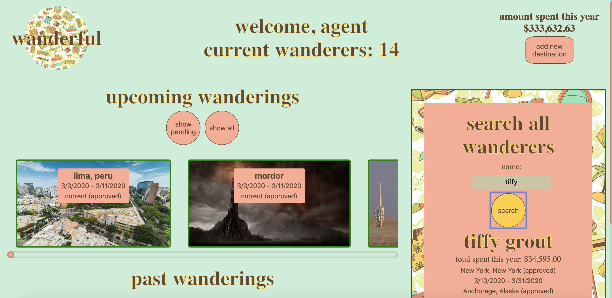

# Wanderful (Travel Tracker)

## Login Screen

## Traveler dashboard

username: traveler1-50 (number is the user id)
password: travel2020

## Agency Dashboard

username: agency
password: travel2020

## Application Description

Wanderful is an application that allows users to request travel bookings, view the details
of their trips, see the cost breakdown for a trip, and view how a countdown to their next trip.
It allows the agency to view the details of requested trips, approve or deny requested
trips, search for users to modify their trips, and view the people traveling and yearly
revenue for the agency.

## Technologies Used

- HTML and SCSS
- JavaScript
- jQuery
- fetch API
- Mocha and Chai (including chai spies)

## Learning Takeaways

- Successful integration of interspersed asynchronous server calls
- Enhanced understanding of the jQuery library
- Continued focus on and refinement of TDD
- Organized CSS using SASS and mixins for media queries
- Accessibility-oriented design with navigation geared towards tabbing and screen readers

## Ideas for future iterations

- More error handling and confirmations required to make big system changes
- Browsing by destination and seeing lists of suggested activities
- Notifications for the traveler upon trip updates
- Travelers have the ability to submit a request for a trip cancellation
